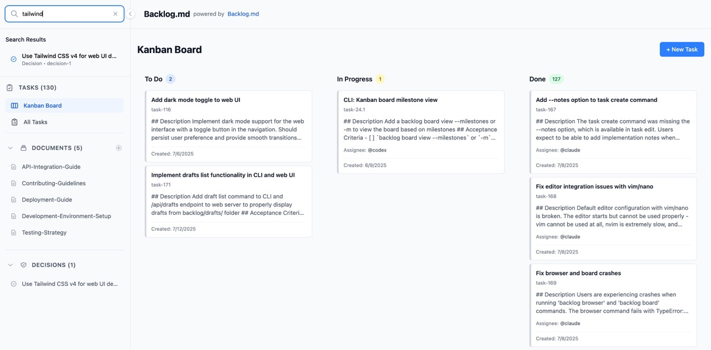
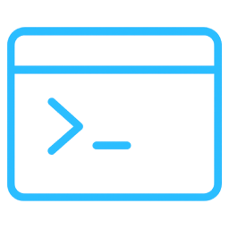

<h1 align="center">epicd</h1>
<p align="center">Markdown‑native Task Manager &amp; Kanban visualizer for any Git repository</p>

<p align="center">
<code>npm i -g epicd</code> or <code>bun add -g epicd</code> or <code>brew install backlog-md</code> or <code>nix run github:MrLesk/Backlog.md</code>
</p>


---

> **Backlog.md** turns any folder with a Git repo into a **self‑contained project board**
> powered by plain Markdown files and a zero‑config CLI.
> Built for **spec‑driven AI development** — structure your tasks so AI agents deliver predictable results.

## Features

* 📝 **Markdown-native tasks** -- manage every issue as a plain `.md` file

* 🤖 **AI-Ready** -- Works with Claude Code, Gemini CLI, Codex, Kiro & any other MCP or CLI compatible AI assistants

* 📊 **Instant terminal Kanban** -- `backlog board` paints a live board in your shell

* 🌐 **Modern web interface** -- `backlog browser` launches a sleek web UI for visual task management

* 🔍 **Powerful search** -- fuzzy search across tasks, docs & decisions with `backlog search`

* 📋 **Rich query commands** -- view, list, filter, or archive tasks with ease
* ✅ **Definition of Done defaults** -- add a reusable checklist to every new task

* 📤 **Board export** -- `backlog board export` creates shareable markdown reports

* 🔒 **100 % private & offline** -- backlog lives entirely inside your repo and you can manage everything locally

* 💻 **Cross-platform** -- runs on macOS, Linux, and Windows

* 🆓 **MIT-licensed & open-source** -- free for personal or commercial use


---

##  Getting started

```bash
# Install
bun i -g epicd
# or: npm i -g epicd
# or: brew install backlog-md

# Initialize in any Git repo
backlog init "My Awesome Project"

# Or initialize without Git for local/non-code projects
backlog init "Personal Planning" --no-git
```

The init wizard will ask how you want to connect AI tools:
- **CLI instructions** (recommended) — creates a short instruction file that tells agents to run `backlog instructions overview`.
- **MCP connector** — optionally auto-configures Claude Code, Codex, Gemini CLI, Kiro or Cursor for teams that prefer MCP.
- **Skip** — no AI setup; use Backlog.md purely as a task manager.

Backlog data is stored in a project-local backlog folder such as `backlog/`, `.backlog/`, or a custom project-relative path configured through `backlog.config.yml`. Tasks remain human-readable Markdown files (e.g. `task-10 - Add core search functionality.md`). Git is optional: `backlog init --no-git` creates a filesystem-only project and disables cross-branch checks, remote operations, and auto-commit.

---

### Working with AI agents

This is the recommended flow for Claude Code, Codex, Gemini CLI, Kiro and similar tools — following the **spec‑driven AI development** approach.
After running `backlog init`, agents should start by running `backlog instructions overview`. Work in this loop:

**Step 1 — Describe your idea.** Tell the agent what you want to build and ask it to split the work into small tasks with clear descriptions and acceptance criteria.

**🤖 Ask your AI Agent:**
> I want to add a search feature to the web view that searches tasks, docs, and decisions. Please decompose this into small Backlog.md tasks.

> [!NOTE]
> **Review checkpoint #1** — read the task descriptions and acceptance criteria.

**Step 2 — One task at a time.** Work on a single task per agent session, one PR per task. Good task splitting means each session can work independently without conflicts. Make sure each task is small enough to complete in a single conversation. You want to avoid running out of context window.

**Step 3 — Plan before coding.** Ask the agent to research and write an implementation plan in the task. Do this right before implementation so the plan reflects the current state of the codebase.

**🤖 Ask your AI Agent:**
> Work on BACK-10 only. Research the codebase and write an implementation plan in the task. Wait for my approval before coding.

> [!NOTE]
> **Review checkpoint #2** — read the plan. Does the approach make sense? Approve it or ask the agent to revise.

**Step 4 — Implement and verify.** Let the agent implement the task.

> [!NOTE]
> **Review checkpoint #3** — review the code, run tests, check linting, and verify the results match your expectations.

If the output is not good enough: clear the plan/notes/final summary, refine the task description and acceptance criteria, and run the task again in a fresh session.

---

### Working without AI agents

Use Backlog.md as a standalone task manager from the terminal or browser.

```bash
# Create and refine tasks
backlog task create "Render markdown as kanban"
backlog task edit BACK-1 -d "Detailed context" --ac "Clear acceptance criteria"

# Track work
backlog task list -s "To Do"
backlog task edit BACK-1 --comment "Can we split the UI work into a separate PR?" --comment-author @sara
backlog search "kanban"
backlog board

# Work visually in the browser
backlog browser
```

You can switch between AI-assisted and manual workflows at any time — both operate on the same Markdown task files. It is recommended to modify tasks via Backlog.md commands (CLI/MCP/Web) rather than editing task files manually, so field types and metadata stay consistent. Tasks can record project-root-relative modified files and later be found with `backlog search --modified-file src/path.ts --plain`. Use task comments for discussion and review notes; comment bodies may contain Markdown, but standalone `---` lines are reserved as comment delimiters. Use Implementation Notes for execution progress and Final Summary for completion notes.

**Learn more:** [CLI reference](CLI-INSTRUCTIONS.md) | [Advanced configuration](ADVANCED-CONFIG.md)

---

##  Web Interface

Launch a modern, responsive web interface for visual task management:

```bash
# Start the web server (opens browser automatically)
backlog browser

# Custom port
backlog browser --port 8080

# Don't open browser automatically
backlog browser --no-open
```

**Features:**
- Interactive Kanban board with drag-and-drop
- Task creation and editing with rich forms
- Interactive acceptance criteria editor with checklists
- Real-time updates across all views
- Responsive design for desktop and mobile
- Task archiving with confirmation dialogs
- Seamless CLI integration - all changes sync with markdown files



To keep the Web UI running as an auto-starting local service, see [Running Backlog.md as a Service](backlog/docs/doc-003%20-%20Running-Backlog-Browser-as-a-Service.md).

---

## 🔧 MCP Integration (Model Context Protocol)

CLI instructions are the default AI setup. MCP remains supported for AI coding assistants like Claude Code, Codex, Gemini CLI and Kiro when you explicitly prefer an MCP connector.
You can run `backlog init` (even if you already initialized Backlog.md) and choose MCP integration, or follow the manual steps below.

### Client guides

<details>
  <summary><strong>Claude Code</strong></summary>

  ```bash
  claude mcp add backlog --scope user -- backlog mcp start
  ```

</details>

<details>
  <summary><strong>Codex</strong></summary>

  ```bash
  codex mcp add backlog -- backlog mcp start
  ```

</details>

<details>
  <summary><strong>Gemini CLI</strong></summary>

  ```bash
  gemini mcp add backlog -s user backlog mcp start
  ```

</details>

<details>
  <summary><strong>Kiro</strong></summary>

  ```bash
  kiro-cli mcp add --scope global --name backlog --command backlog --args mcp,start
  ```

</details>

Use the shared `backlog` server name everywhere. The server finds the active project from your client's MCP roots, and re-resolves when you switch workspace or worktree. Until it finds one, it serves `backlog://init-required`. A single user-scope server covers every repo.

### Manual config

```json
{
  "mcpServers": {
    "backlog": {
      "command": "backlog",
      "args": ["mcp", "start"],
      "env": {
        "BACKLOG_CWD": "/absolute/path/to/your/project"
      }
    }
  }
}
```

Set `BACKLOG_CWD` to pin the server to one project and stop workspace following. Use it to always target the same backlog, or when your client can't report MCP roots.
If your IDE supports custom args but not env vars, you can also use `["mcp", "start", "--cwd", "/absolute/path/to/your/project"]`.

> [!IMPORTANT]
> When adding the MCP server manually, add a short instruction to your CLAUDE.md/AGENTS.md files telling agents to read `backlog://workflow/overview`.
> This step is not required when using `backlog init` as it adds these instructions automatically.
> For CLI-based setups, use `backlog instructions overview` to fetch the current workflow guidance.


Once connected, agents can read the Backlog.md workflow instructions via `backlog://workflow/overview`, with detailed guides at `backlog://workflow/task-creation`, `backlog://workflow/task-execution`, and `backlog://workflow/task-finalization`.
Use `/mcp` command in your AI tool (Claude Code, Codex, Kiro) to verify if the connection is working.

---

##  CLI reference

Full command reference — task management, search, board, docs, decisions, and more: **[CLI-INSTRUCTIONS.md](CLI-INSTRUCTIONS.md)**

Quick examples: `backlog`, `backlog instructions`, `backlog task create`, `backlog task list`, `backlog task edit`, `backlog milestone add`, `backlog milestone rename`, `backlog milestone remove`, `backlog search`, `backlog board`, `backlog browser`.

Full help: `backlog --help`

---

##  Configuration

Backlog.md merges the following layers (highest → lowest):

1. CLI flags
2. Project config file:
   - `backlog.config.yml` when present
   - otherwise `backlog/config.yml` or `.backlog/config.yml`
3. Built‑ins

### Interactive wizard (`backlog config`)

Run `backlog config` with no arguments to launch the full interactive wizard. This is the same experience triggered from `backlog init` when you opt into advanced settings, and it walks through the complete configuration surface:
- Cross-branch accuracy: `checkActiveBranches`, `remoteOperations`, and `activeBranchDays`.
- Git workflow: `autoCommit` and `bypassGitHooks`.
- ID formatting: enable or size `zeroPaddedIds`.
- Editor integration: pick a `defaultEditor` with availability checks.
- Definition of Done defaults: interactively add/remove/reorder/clear project-level `definition_of_done` checklist items.
- Web UI defaults: choose `defaultPort` and whether `autoOpenBrowser` should run.

Skipping the wizard (answering "No" during init) applies the safe defaults that ship with Backlog.md:
- `checkActiveBranches=true`, `remoteOperations=true`, `activeBranchDays=30`.
- `autoCommit=false`, `bypassGitHooks=false`.
- `zeroPaddedIds` disabled.
- `defaultEditor` unset (falls back to your environment).
- `defaultPort=6420`, `autoOpenBrowser=true`.

For filesystem-only projects, run `backlog init --no-git`. Backlog.md will not run `git init`, and the saved config forces `checkActiveBranches=false`, `remoteOperations=false`, and `autoCommit=false` so CLI, Web, and MCP local-file workflows do not depend on a Git repository.

Whenever you revisit `backlog init` or rerun `backlog config`, the wizard pre-populates prompts with your current values so you can adjust only what changed.

### Definition of Done defaults

Set project-wide DoD items with `backlog config` (or during `backlog init` advanced setup), in the Web UI (Settings → Definition of Done Defaults), or by editing the project config file directly:

```yaml
definition_of_done:
  - Tests pass
  - Documentation updated
  - No regressions introduced
```

When a project uses root config discovery, edit `backlog.config.yml` instead of `backlog/config.yml`.

These items are added to every new task by default. You can add more on create with `--dod`, or disable defaults per task with `--no-dod-defaults`.

For the full configuration reference (all options, commands, and detailed notes), see **[ADVANCED-CONFIG.md](ADVANCED-CONFIG.md)**.

---

## 🌐 Community Tools

- **[vscode-backlog-md](https://marketplace.visualstudio.com/items?itemName=ysamlan.vscode-backlog-md)** - VS Code extension with issues panel, kanban view, and editing. ([ysamlan/vscode-backlog-md](https://github.com/ysamlan/vscode-backlog-md))

---

### License

Backlog.md is released under the **MIT License** – do anything, just give credit. See [LICENSE](LICENSE).
