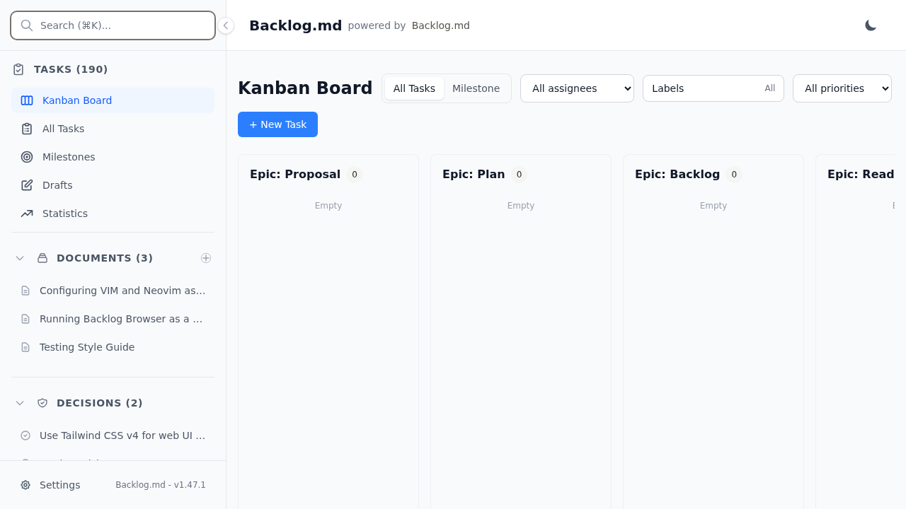
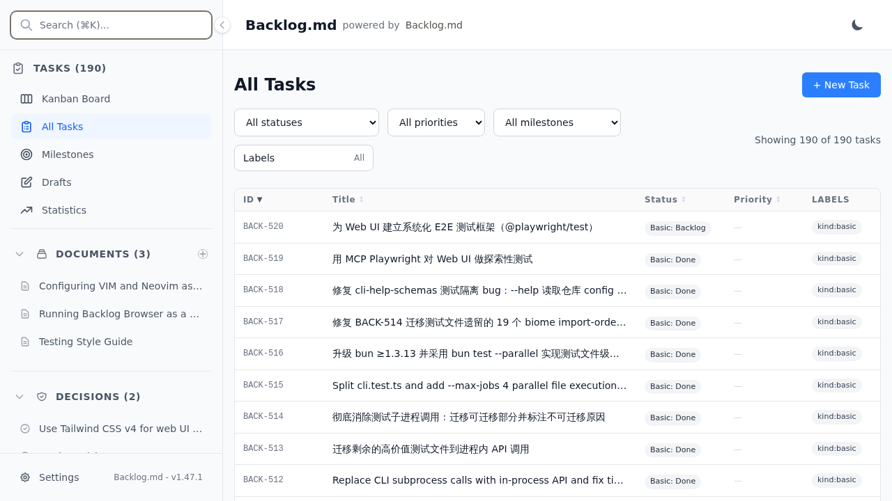
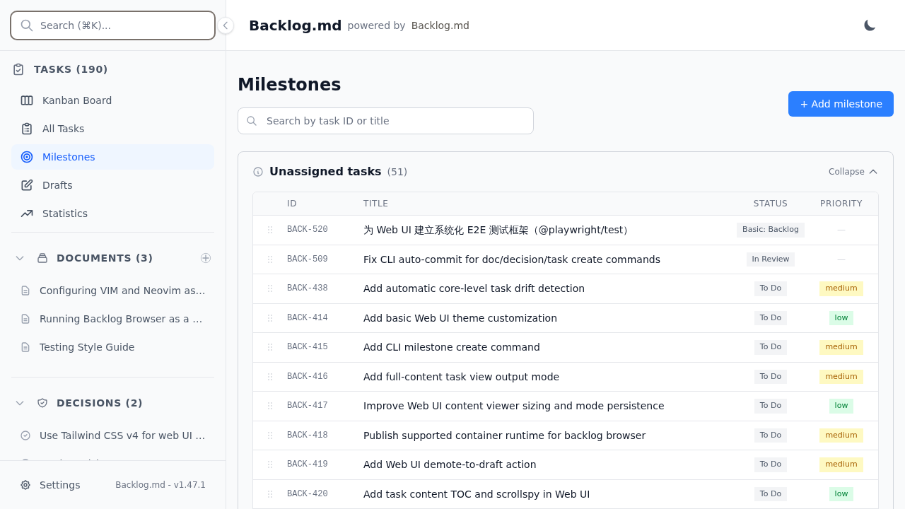
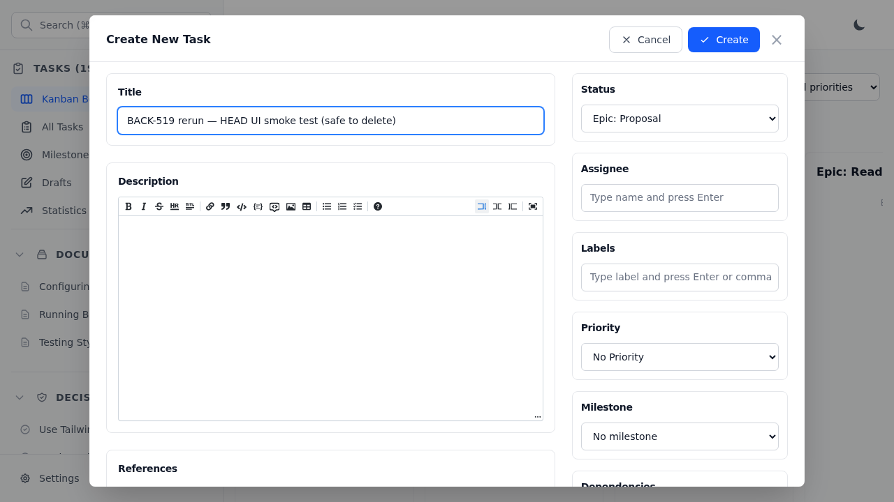
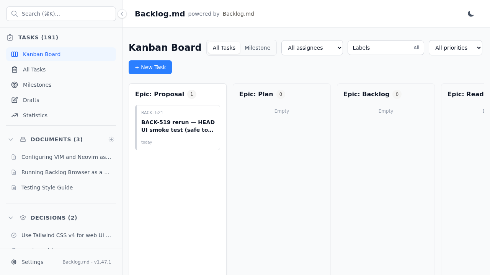
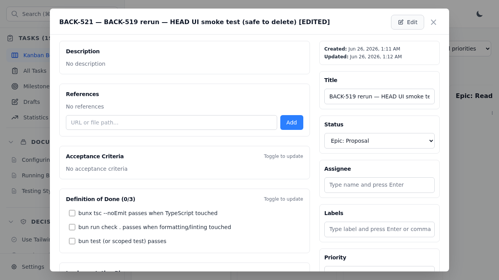

# Web UI Smoke Test Report (BACK-519)

Exploratory smoke test of the Backlog.md React Web UI (`src/web/`) using the MCP
Playwright tools. No test infrastructure was added — this is a manual interactive
verification that establishes a baseline of UI health and documents a repeatable method.

- **Task:** BACK-519 — 用 MCP Playwright 对 Web UI 做探索性测试
- **Authoritative run:** 2026-06-26, against a fresh server built from the current
  branch HEAD (Backlog.md **v1.47.1**), serving this repository's own data.
- **Verdict:** **GREEN** — all four flows render and work; **0 console errors, 0 warnings**.

> An earlier autonomous run accidentally tested a pre-existing v1.45.0 server for an
> unrelated project (port-6420 collision). This report documents the corrected re-run
> on a free port against a HEAD build. See "Known pitfalls" below.

## Method (repeatable)

1. **Pick a free port** (default 6420/6421 may already be in use by another
   `backlog browser` instance):

   ```bash
   for p in 6433 6444 6455; do
     curl -sf http://localhost:$p >/dev/null 2>&1 && echo "$p IN USE" || { echo "$p FREE"; break; }
   done
   ```

2. **Start a fresh server from the current build** (not a pre-existing instance — that
   guarantees you test the current code and your own data):

   ```bash
   nohup bun run cli browser --no-open --port 6433 > /tmp/backlog-ui-server.log 2>&1 &
   until curl -sf http://localhost:6433 >/dev/null 2>&1; do sleep 0.5; done
   curl -s http://localhost:6433 | grep -oE '<title>[^<]*</title>'   # sanity check
   ```

3. **Drive the UI with MCP Playwright tools** (`mcp__playwright__browser_*`):
   `browser_navigate` → `browser_snapshot` (to obtain element refs) →
   `browser_click` / `browser_type` → `browser_take_screenshot`. Screenshots must be
   written inside the repo (the tool restricts output to repo roots), then relocated.

4. **Check the console** after each flow: `browser_console_messages` at `warning` level.

5. **Clean up:** archive + delete any task created during the test, stop the server,
   relocate screenshots out of the repo root.

## Results

All screenshots below are from the v1.47.1 HEAD run and live in
[`docs/assets/ui-smoke-test/`](../assets/ui-smoke-test/).

### Phase 1 — Home / Kanban Board

Route `/` renders the Kanban Board with the full Epic + Basic status lanes, sidebar nav
(Kanban Board, All Tasks, Milestones, Drafts, Statistics), search, theme toggle, and the
project's documents/decisions. Title bar confirms **Backlog.md v1.47.1**, 190 tasks.



### Phase 2 — All Tasks & Milestones

- `/tasks` — All Tasks table renders 190/190 with Status/Priority/Labels columns and
  filter controls; this repo's real tasks (BACK-512…519) are listed.
- `/milestones` — heading, "+ Add milestone" button, and an "Unassigned tasks" group
  with drag-to-assign handles.




### Phase 3 — Create-task flow

"+ New Task" opens the "Create New Task" modal (Title, rich-text Description editor,
Status, Assignee, Labels, Priority, Milestone, References, Acceptance Criteria,
Definition of Done, Implementation Plan/Notes, Dependencies). Submitting created a task
that appeared on the board and bumped the task count 190 → 191.




### Phase 4 — Edit-task flow

Clicking the card opens `TaskDetailsModal`. Entering Edit mode, changing the title, and
clicking Save persisted the change — modal header shows the new title and the "Updated"
timestamp advanced past "Created".



## Console

`browser_console_messages` reported **0 errors and 0 warnings** across the entire HEAD
run. (The earlier v1.45.0 autonomous run showed one benign warning only: a live-reload
`WebSocket closed before the connection is established`.)

## Known pitfalls

- **Port collisions:** ports 6420/6421 are frequently held by other long-running
  `backlog browser` instances (possibly serving a different project). Always verify the
  `<title>`/project name after connecting; pick a free port and start your own server.
- **Screenshot output sandbox:** the Playwright MCP tool can only write within repo
  roots, not `/tmp`. Save to the repo, then move.
- **Test data side effects:** creating a task writes a real task file. Archive **and**
  delete it afterward so the board returns to its baseline count.

## Scope / limitations

- Manual exploratory smoke test, not an automated regression suite. There is no CI gate.
- For a systematic, CI-runnable E2E suite, see the follow-up task BACK-520
  ("为 Web UI 建立系统化 E2E 测试框架（@playwright/test）").
